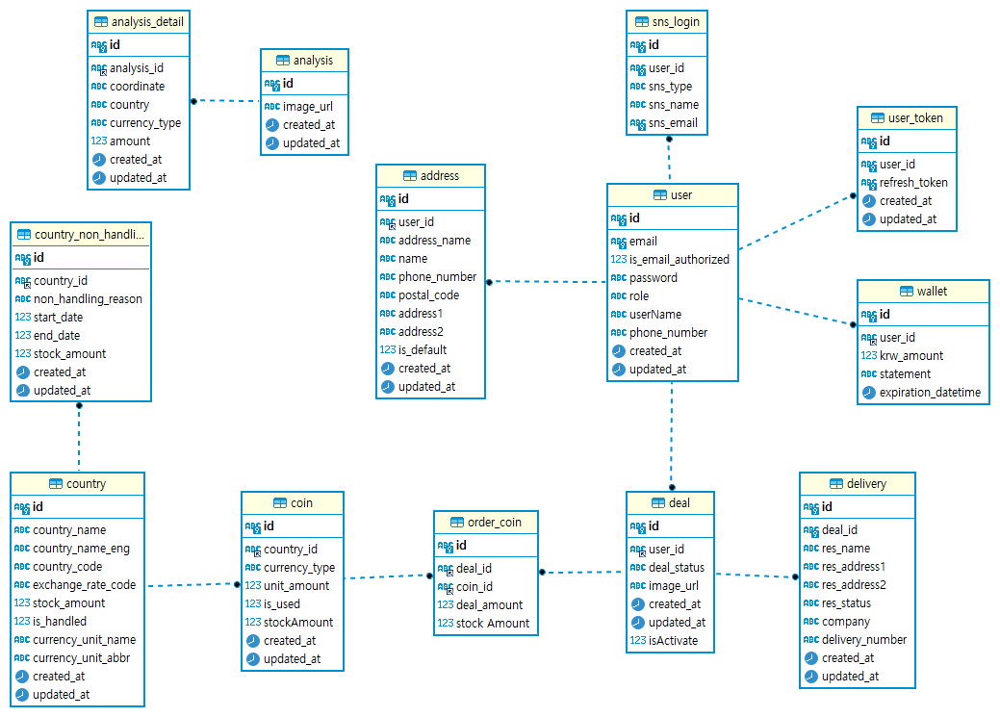
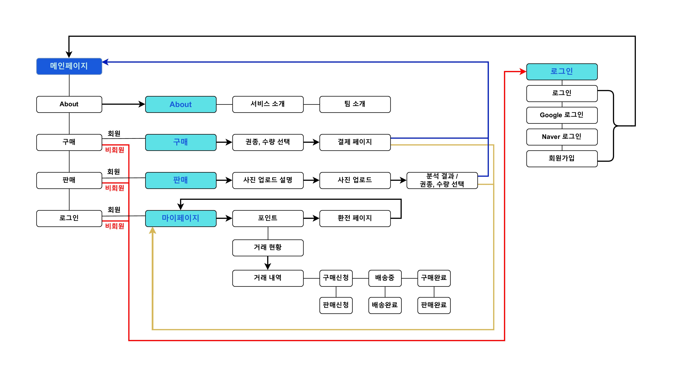
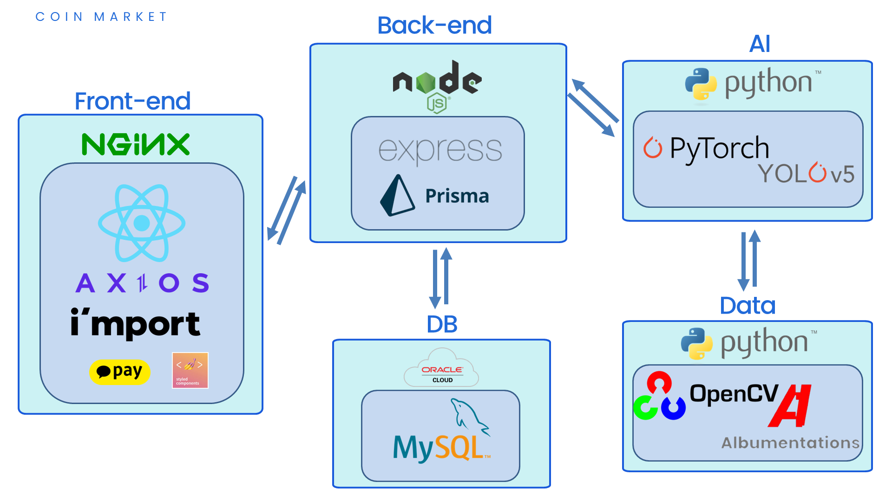

# 

<h1>목차</h1>

- 
- [1. 서비스 소개](#1-서비스-소개)
  - [📌 목적](#-목적)
  - [🤔 기획 의도](#-기획-의도)
- [2. 기술 스택](#2-기술-스택)
  - [🖥️ FRONT-END](#️-front-end)
  - [💾 BACK-END](#-back-end)
  - [🤖 AI](#-ai)
- [3. 팀원 역할 및 기여 부분](#3-팀원-역할-및-기여-부분)
  - [1. 신성우](#1-신성우)
  - [2. 문동규](#2-문동규)
  - [3. 정민규](#3-정민규)
  - [4. 홍지민](#4-홍지민)
- [4. 프로젝트 구성도](#4-프로젝트-구성도)
  - [💾 데이터 구조 (ERD)](#-데이터-구조-erd)
  - [▶️ 서비스 구조도](#️-서비스-구조도)
  - [🔎 프로젝트 구조도](#-프로젝트-구조도)
  - [🖥️ 와이어 프레임](#️-와이어-프레임)
    - [FIGMA](#figma)
- [5. 기능 설명](#5-기능-설명)
- [6. 시연 영상](#6-시연-영상)
    - [시연 영상 (유튜브)](#시연-영상-유튜브)

<!--  -->

<h3> 팀원: 신성우, 문동규, 정민규, 홍지민 </h3>

<h3> 프로젝트 기간: 2022년 11월 14일 → 2022년 12월 17일 </h3>

# 1. 서비스 소개

## 📌 목적

**외화 동전 거래 서비스**

- 보유한 외화 동전의 이미지를 이용하여 해당 외화의 이름과 환율을 알 수 있다.
- 판매자는 환율의 70%의 값으로 판매할 수 있다. (은행 대비 +20%)
- 구매자는 환율의 80%의 값으로 구매할 수 있다. (은행 대비 -20%)

## 🤔 기획 의도

> 보유한 외화 동전을 원화로 환전 하기 위해서는 은행에 가야 한다.  
> 하지만 모든 은행이 외화 동전을 환전 해주지는 않는다. 환전을 해주는 곳이라 하더라도 환율의 50%값만 환전 받을 수 있다.  
> 외화 동전이 필요해서 환전을 받는 사람은 환율의 100% 값을 지불하고 환전을 받는다.  
> 은행을 통하지 않고 서로 거래를 할 수 있다면 더 합리적인 환전이 가능할 것이라고 생각했다.  
> 판매자는 환율의 70% 값으로 판매하여 은행 대비 20%의 이윤을 남기고  
> 구매자는 환율의 80% 값으로 구매하여 은행 대비 20%의 이윤을 남긴다.

---

---

# 2. 기술 스택

## 🖥️ FRONT-END

- **React**

  컴포넌트 단위 개발을 통해서 유지 보수에 용이하고 가독성이 좋아져서 관리하기 편하고, 코인마켓 서비스의 페이지 수가 많이 존재하지만 SPA로서 변경되는 부분만 재렌더링하기에 효율적이고, 부드러운 동작을 보여주기 때문에 선택하였습니다. 익숙한 자바스크립트와 HTML 문법과 매우 유사한 JSX도 선택이유에 포함됩니다.

- **Axios**

  백엔드와 api 통신하기 위한 목적과 브라우저 호환성이 좋은 점, 내장 라이브러리에 없는 기능을 사용하고, JSON으로 변환해주는 과정 불필요해서 내장라이브러리보다 데이터를 쉽게 다룰 수 있다고 생각하여 선택하였습니다.

- **Styled Components**

  익숙한 css 문법을 사용하면서 컴포넌트화하여 관리하기에도 용이하고, 쉽게 사용할 수 있다고 생각되었고, React에서 props를 활용하여 조건부 스타일링이 가능해서 선택하였습니다.

## 💾 BACK-END

- **Node.js**

  프론트와 백엔드를 함께 해야 하는 상황에서 js를 사용할 수 있어 작업의 연속성과 효율성을 기대 할 수 있으며 단일스레드로 복잡한 작업이 많지 않은 코인마켓 서비스와 맞다 판단되어 선택

- **Express**

  Node.js 환경에서 가장 많이 보편적으로 사용되기 때문에 많은 레퍼런스를 찾을 수 있으며 라우팅과 로직을 모듈화 하여 기능별 파일 관리 및 생산성 향상등의 장점이 있어 선택

- **MySQL**

  편리한 인터페이스와 많은 사용자를 가진 관계형 DB로서 많은 데이터 타입을 지원하고 속도와 안정성를 중점으로 하는 특성상 복잡하지 않은 구조를 가진 코인마켓 서비스와 잘 맞다 판단되어 선택

- **PrismaORM**

  MySQL서버를 사용하기 위한 많은 도구중 풍부한 공식문서가 제공되고 Prisma shcema를 통한 생산성 높은 테이블 생성 , 협업을 위한 DB스키마 공유 등의 장점으로 인해 선택

- **Oracle Cloud**

  무료 제공 VM중 한국리전 제공하는 서비스이고 이전 사용 경험상 문제 없는 수준의 속도를 제공해 주기 때문에 DB서버 분리를 위한 서버로 선택

## 🤖 AI

- Python

  Programing Language중 무료에 접근성이 좋으며, Stack Overflow에 많은 커뮤니티가 형성 돼있으므로 검색을 통해 도움을 받기 쉽다. 또한 많은 Deep Learning 프레임워크 또한 Python으로 작성된 것이 많으므로 가장 적합한 언어라고 생각했다.

- PyTorch

  아래에 서술될 YOLO가 PyTorch를 기반으로 만들어졌으며 Keras보다 모델의 Neural Network의 수정이 간편하다는 장점이 있다. 또한 CUDA를 이용하여 GPU 가속을 통해 모델의 학습과 퍼포먼스의 향상을 이뤄낼 수 있다는 점이 매력적이다.

- YOLOv5

  Image Detection 문제는 R-CNN의 Two Stage 방식이 전통적으로 채택 되는편이지만, 실시간으로 문제를 해결하고자 할 땐 YOLO가 많이 선택되고 있다. 기존의 Two Stage 방식은 Image Detection과 Classification을 순차적으로 진행하기 때문에 처리속도에서 손해를 보게 되므로 실시간 처리에는 적합하지 못하다는 단점이 존재했다. YOLO는 이 과정을 One Stage에서 한번에 처리하게 되므로 Two Stage 방식보단 정확성이 조금 떨어지지만 처리속도에서 이득을 보게 되므로 실시간 처리에 좀 더 용이하다. 최근엔 모델의 고도화를 통해 One Stage 방식의 처리속도를 가지고 있지만 Two Stage의 정확성을 가지는 모델도 등장하기 시작했다 (SSD).

- OpenCV

  이미지를 이용한 Deep Learning을 이용하기 위해서 전처리 과정이 필요한데, 이를 OpenCV로 해결할 수 있다. Python에서 이미지를 컨트롤하고 처리하기 용이하게 만들어주는 라이브러리이며 본 프로젝트에서는 이미지의 전처리뿐만 아니라 YOLO Dataset에 맞는 라벨링 툴을 직접 제작하였다. 사용자가 직접 Detect Box를 지정해주는 것이 아닌 Hough Transform 기법을 기반으로 자동으로 Bbox를 지정해주며 원하는 Label을 YOLO에 맞게 생성할 수 있다.

- Albumentations

  본 프로젝트에서 가장 큰 트러블은 외화 동전의 Raw Image Data를 구하기 힘들다는 것이였다. 실제로 구글링을 통해서도 그렇게 많은 외화 동전 이미지를 구할 수 없었으며, 정권이 바뀌거나 왕이 교체되는 사건을 통해 외화 동전이 바뀌는 나라도 존재하므로 이미지를 막 수집하는 것도 어려웠다. 때문에 저희팀은 라이브러리를 이용하여 데이터 증강을 통해서 이미지 수를 늘렸고, 특히나 실제 사진을 찍을 땐 동전이 회전된 경우가 많으므로, 데이터 증강을 할 때 주로 회전을 통해서 약 500장 이상의 이미지 데이터를 구현했다.

---

---

# 3. 팀원 역할 및 기여 부분

## 1. 신성우

1.  프론트엔드
    1. [FE] 로그인, 회원가입 기능
       - 전체적인 폼 UI, api 통신으로 정보 요청 및 관리
       - jwt token을 sessition storage에 저장하여 로그인 상태 관리
       - axios interceptor 기능을 사용해서 refresh token 관리
       - 로그인, 회원가입 폼 유효성 검사
    2. [FE] 구매, 판매 UI 및 기능
       - 구매페이지 및 판매 페이지 단계별 페이지 구성 (UI)
       - 구매페이지 아임포트 결제 API 사용해서 테스트 결제 구현
       - 판매페이지 사진 업로드 후 미리보기 구현
       - 판매페이지 분석된 사진을 API 통신을 통해서 정보 요청 및 관리
    3. [FE] 레이아웃 UI
       - header, footer 컴포넌트를 구성하여 전체적인 틀 생성
       - 미디어쿼리를 활용한 반응형 웹 페이지
    4. [FE] 환전페이지 및 마이페이지
       - API 통신으로 유저 정보 및 거래 정보 요청 및 관리

## 2. 문동규

1.  백엔드
    1. [BE] 구매, 판매 로직 설계 및 API제작
       - 각 판매, 구매 주문의 연동이 가능하도록 로직 설계
       - 구매시 금액 및 수량의 검증 및 위변조 차단
       - 아임포트 결제 api 사용하여 해당 결제 내역검증
       - 모든 거래시 DB호출은 벌크처리 및 로직 최적화를 통해 호출을 최소화 하려 하였으며 Transaction 처리하여 오류 발생시 해당 거래 일괄 rollback 되도록 처리
    2. [BE] 환율, 재고조회등의 공용API 설계 및 제작
       - 외부 환율 API을 조회후 재 가공하여 제공
       - 기타 거래에 필요한 정보(재고,국가리스트,권종등) DB에서 조회하여 가공하여 제공
    3. [BE] DB서버 오라클 클라우드 사용하여 외부로 분리
       - 개발중 동일 DB공유를 위해 WAS와 DB서버를 분리
    4. [FE] MyPage 제작
       - 기본적인 유저의 거래내역을 볼 수 있는 마이페이지 제작

## 3. 정민규

1.  백엔드
    1. [BE] 회원가입, 로그인, 개인정보 로직 설계 및 API제작
       - 회원가입, 로그인 구현
       - access토큰 갱신 → refresh토큰도 같이 갱신
         (refresh 토큰을 보호하기 위해 일회성으로 유효하게)
       - refresh토큰 암호화해서 db저장 (bcrypt)
       - 주소 여러 개 등록 가능
       - 메일 인증 구현 ( nodemailer )
       - 구글, 네이버 로그인 구현
         (passport-google-oauth20, passport-naver-v2)
    2. [BE] 배송지 설정, 거래 상태 로직 설계 및 API제작
       - 기본 배송지 설정 → 기존 기본 배송지 상태 자동 해제
       - req.query로 구매, 판매, 배송중 별 거래 상태 출력
         (특정 거래 선택 시 → 해당 거래 내역과 배송 정보 함께 출력)
    3. [BE] 포인트 로직 설계 및 API제작
       - 포인트 환전 시 → 환전 금액과 내용 db저장 → 포인트 최신화
         (선분이력 관리)
    4. [FE] AboutPage (서비스 소개 페이지) 제작
       - 스크롤 애니메이션을 적용, 동적인 효과 부여.
    5. [FE] 반응형 웹 디자인

## 4. 홍지민

1.  인공지능
    1. [AI] 모델 튜닝 및 학습
       - 데이터 수집(Raw Image 100장)
       - OpenCV를 이용한 데이터 전처리 및 라벨링 툴 제작
       - 여러가지 시도를 통한 최적의 모델 튜닝
         → 좀 더 높은 정확도를 위해 동전의 앞면과 뒷면을 따로 학습
         → Image의 Feature Map을 잘 구별할 수 있게 Gray Scale로 학습 했으나, Recall이 좋지 못하므로 RGB Scale로 학습
         → 최신 모델인 YOLOv7을 이용하였으나 현재 모델의 크기가 작은 모델만 있으므로, 안정적인 성능과 큰 크기의 모델을 이용할 수 있는 YOLOv5 X모델을 이용
       - Raw Image 데이터가 굉장히 부족하므로 라이브러리를 이용하여 학습할 수 있는 이미지 증강 (약 500장)
       - Train: Precision(0.96), Recall(0.95), F1(0.95)
       - Test: Precision(0.96), Recall(0.99), F1(0.97)
    2. [AI] 모델과 Node.js 연결
       - Node.js에서 PythonShell을 이용하여 모델과 연결됨
       - 서버에서는 모델에서 Detect된 결과만을 받아 Return
       - 다만, Shell을 띄우기 때문에 속도가 느림
         → Django(Flask)와 같은 파이썬 서버로 개선하면 좋을 듯
    3. [FE] Main Page 제작
       - 애니메이션 효과로 심심하지 않은 웹 구현
       - Navigation Button을 활용한 스크롤 이동}
       - 실시간 환율 및 미디어 쿼리를 이용한 반응형 웹

---

---

# 4. 프로젝트 구성도

## 💾 데이터 구조 (ERD)

<!-- {: width="100" height="100"} -->

## ▶️ 서비스 구조도

<!--  -->

## 🔎 프로젝트 구조도

<!--  -->

## 🖥️ 와이어 프레임

### [FIGMA](https://www.figma.com/file/R7fozbkLMg3LFa6gEYj1zC/%EC%BD%94%EC%9D%B8%EB%A7%88%EC%BC%93?node-id=0%3A1&t=41Tf1Udb9gkN53X1-0)

---

---

# 5. 기능 설명

1. 메인서비스
   1. 판매
      - 동전 사진 업로드 후 AI를 통해 분석하여 해당 권종별 구분, 계수 가능
      - 환율 API 참고하여 예상 금액 안내 (환율의 70%)
      - 수량 및 권종 수정 가능
      - 판매 후 마이페이지 에서 확인 가능
   2. 구매
      - 권종별 재고 확인 및 선택 가능
      - 아임포트 결제 API연동하여 결제 및 결제 확인
      - 구매 후 마이페이지에서 확인 가능
   3. 기타
      - 실시간 환율 서비스 제공
      - 판매를 통해서 얻은 포인트 환전 기능

---

---

# 6. 시연 영상

### [시연 영상 (유튜브)](https://www.youtube.com/watch?v=wUmSfW9H5bw)
